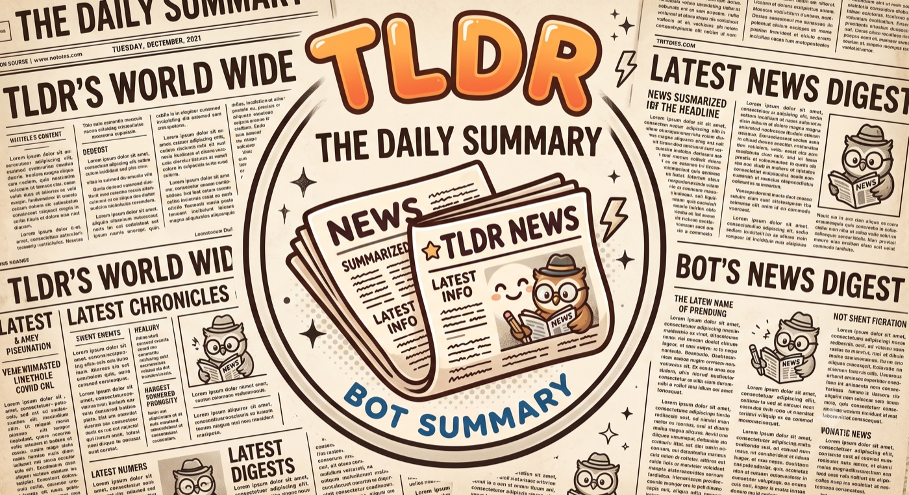

# tldr-summarizer-bot

<p align="center">
  
</p>

A personal Telegram bot for [TLDR](https://tldr.tech) newsletters with two surfaces, both running free:

1. **Scheduled digest (push)** — twice a day, GitHub Actions fetches the latest issues of six TLDR newsletters, merges them into one deduplicated, themed digest via the opencode API, and sends it to Telegram.
2. **Conversation (pull)** — a Cloudflare Worker receives your Telegram messages via webhook in real time: build a digest on demand, ask about a topic, or free-form Q&A grounded in today's stories.

Covered newsletters: **Tech, AI, IT, Web Dev, InfoSec, DevOps, Design, Data**

*(TLDR publishes on weekdays and cadence varies per newsletter — e.g. Data runs Mon & Thu, DevOps Mon/Wed/Fri — so unpublished dates are skipped automatically).*

## Architecture

```
                    ┌──────────────────────────────────────────────┐
  cron 13:00 &      │ GitHub Actions (.github/workflows/digest.yml) │
  01:00 UTC ───────►│  uv run python -m tech_news_summarizer       │
                    │  └─ commits data/state.json back (dedup)     │
                    └──────────────┬───────────────────────────────┘
                                   │ one merged digest/day
                                   ▼
   you ◄──────────────────────  Telegram  ◄─────────────────────┐
    │                                                            │
    │ /digest, /news <topic>, questions                          │ replies
    ▼                                                            │
  Telegram ──POST /webhook──► Cloudflare Worker (worker/) ───────┘
                               ├─ secret-token + chat-id gating
                               ├─ KV: story cache, digest cache,
                               │      update dedup, chat history
                               └─ opencode API for merging & Q&A

  Both paths share:  tldr.tech/{category}/{date}  and  the opencode Go API
```

**Data flow (Python push pipeline, `src/tech_news_summarizer/`):**

| Stage | Module | What it does |
|---|---|---|
| Fetch | `fetcher.py` | GET `tldr.tech/{category}/{date}`; parse stories (headline, blurb, link); filter sponsors/self-promo; strip `utm_*` params. Falls back to yesterday's issue when today's isn't published yet (TLDR publishes ~6 AM US Eastern). |
| Merge | `summarizer.py` | One LLM call merges all newsletters: dedups cross-newsletter stories, picks the 10–15 most significant, groups into themed sections. URLs are validated against the parsed input — the model can't invent links. |
| Send | `telegram.py` | One HTML message via the Bot API, split at 4096 chars if needed. |
| Dedup | `state.py` | `data/state.json` records the last sent issue date per newsletter; committed back to the repo by the workflow (Actions runners are ephemeral). |

**Fallback chain:** no opencode key, `--no-ai`, or the AI call fails → one full parsed digest per newsletter (TLDR's own blurbs verbatim). A failing newsletter never blocks the others; if *everything* fails, the bot sends a warning message and the run exits non-zero.

**Worker (`worker/src/`):** `index.ts` (webhook auth, update-id dedup, routing) → `commands.ts` (`/digest`, `/news`, Q&A with short conversation memory) → `tldr.ts` (TypeScript port of the parser + KV story cache) /
`ai.ts` (opencode client). Slow LLM work runs within the request lifetime — Cloudflare cancels `ctx.waitUntil` work after 30s, shorter than a digest build — and Telegram's webhook retries are neutralized by the update-id dedup. Digests are KV-cached for 6h, so repeat `/digest` replies in seconds.

## Setup

### 1. Telegram bot

- Message [@BotFather](https://t.me/BotFather), send `/newbot`, copy the token (`TELEGRAM_BOT_TOKEN`).
- Send any message to your new bot, then open `https://api.telegram.org/bot<TOKEN>/getUpdates` and copy `result[0].message.chat.id` (`TELEGRAM_CHAT_ID`).

### 2. opencode API

An [opencode](https://opencode.ai) key (`OPENCODE_API_KEY`, from the Zen console) powers the merging and Q&A. Defaults target the **opencode Go subscription** (`deepseek-v4-flash` at `…/zen/go/v1/chat/completions`); pay-as-you-go Zen users set `OPENCODE_API_URL=https://opencode.ai/zen/v1/chat/completions`. The key is optional for the push pipeline (fallback: parsed digests) but required for the conversational worker's AI features.

### 3. Scheduled digest (GitHub Actions)

```bash
gh repo create <name> --private --source . --push
gh secret set TELEGRAM_BOT_TOKEN
gh secret set TELEGRAM_CHAT_ID
gh secret set OPENCODE_API_KEY

# Fire immediately to test:
gh workflow run digest.yml && gh run watch
```

Schedules (`.github/workflows/digest.yml`): **13:00 UTC** delivers each issue the evening it publishes (SGT); **01:00 UTC** is the catch-up. Runs are idempotent — the state file guarantees each issue is sent once — and the state-commit doubles as repo activity, so GitHub never auto-disables the schedule. Scheduled runs may start 5–15 minutes late during GitHub peak load.

### 4. Conversational worker (Cloudflare)

```bash
cd worker && npm install
npx wrangler login
npx wrangler kv namespace create STORE     # put the id in wrangler.toml
npx wrangler secret put TELEGRAM_BOT_TOKEN
npx wrangler secret put OPENCODE_API_KEY
npx wrangler secret put WEBHOOK_SECRET     # e.g. openssl rand -hex 24
npx wrangler secret put ALLOWED_CHAT_ID    # your TELEGRAM_CHAT_ID
npx wrangler deploy

# register the webhook (once):
curl -X POST "https://api.telegram.org/bot<TOKEN>/setWebhook" \
  -H "content-type: application/json" \
  -d '{"url": "https://<worker>.workers.dev/webhook", "secret_token": "<WEBHOOK_SECRET>", "allowed_updates": ["message"]}'
```

Then talk to the bot:

- `/digest` — today's combined digest on demand
- `/news <topic>` — today's stories about a topic
- anything else — Q&A grounded in today's stories (with follow-up memory)

Only `ALLOWED_CHAT_ID` gets answers; webhook calls must carry Telegram's `secret_token` header.

## Archive page

Every sent digest is also written to `docs/data/{date}.json` (committed back
by the workflow, same as the state file), and `docs/index.html` is a static
archive page that lists all dates and renders each day's digest — no build
step, no dependencies.

- **Preview locally:** `python3 -m http.server -d docs` → http://localhost:8000
- **Publish via GitHub Pages** (requires a public repo on the free plan):
  Settings → Pages → *Deploy from a branch* → `main`, folder `/docs`.
  Artifacts accumulate from now regardless, so the archive is already
  populated whenever you flip the repo public.

The page is also an installable **PWA** (`docs/manifest.webmanifest` +
`docs/sw.js`): add it to your home screen for one-tap access, and a service
worker keeps the news readable on a poor or absent connection. The shell is
cached for instant/offline loads; digest data is fetched **network-first with
a short timeout** — fresh news wins when the network is healthy, but a slow
connection falls back to the cached copy instead of hanging (the network
response still refreshes the cache when it lands). On activation the worker
also **pre-caches the most recent days** so recent digests are available
offline even for days you never opened while online. The service worker needs
an https/localhost origin, so it's inactive when opening the page via
`file://` — no web-push (Telegram is the push channel).

## Local development

Requires [uv](https://docs.astral.sh/uv/) (Python) and Node (worker).

```bash
cp .env.example .env          # fill in the values from Setup above

# Push pipeline — print digests without sending anything:
uv run python -m tech_news_summarizer --dry-run --date 2026-07-07

# CLI flags:
#   --dry-run             print instead of sending
#   --date YYYY-MM-DD     specific issue date (default: today→yesterday)
#   --categories tech,ai  subset of newsletters
#   --ignore-state        re-send even if already sent
#   --no-ai               skip AI merging; full parsed digest per newsletter

# Worker — local dev server (put dev values in worker/.dev.vars):
cd worker && npx wrangler dev
```

## Notes

- The TLDR parser exists twice (Python `fetcher.py` for the push pipeline, TypeScript `worker/src/tldr.ts` for the worker) — keep them in sync if TLDR's HTML changes.
- Secrets live only in `.env` / `worker/.dev.vars` (git-ignored), GitHub Actions secrets, and Cloudflare worker secrets — never in the repo.
- Push-pipeline logs are in the repo's Actions tab; worker logs via `npx wrangler tail`.
